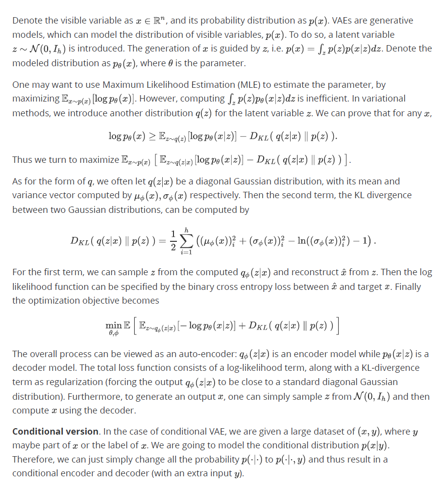
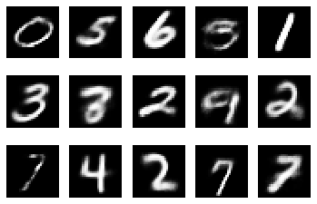
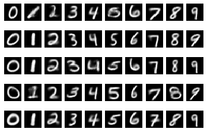

# Variational AutoEncoders

Pytorch implementation for Variational AutoEncoders (VAEs) and conditional Variational AutoEncoders. 


## A short description



## Implementation

The model is implemented in *pytorch* and trained on MNIST (a dataset of handwritten digits) to train the models. The encoders $\mu_\phi, \log \sigma^2_\phi$ are shared convolutional networks followed by their respective MLPs. The decoder is a simple MLP. Please refer to [model.py](Models/VAE/model.py) for more details. 

Samples generated by VAE:



Samples generated by conditional VAE.



To train the model, run

```shell
cd Models/VAE
python train_VAE.py  # or train_cVAE.py
```

To use the models, just run the jupyter notebook [Demo.ipynb](Models/VAE/Demo.ipynb) to see a few illustrations.

## References

[1] Kingma, D. P., & Welling, M. (2013). Auto-Encoding Variational Bayes. *arXiv: Machine Learning*

[2] Jianlin Su (2018, Mar 28). Variational Auto-Encoders: from a Bayesian perspective. (in Chinese) *Blog post: Retrieved from https://kexue.fm/archives/5343*
